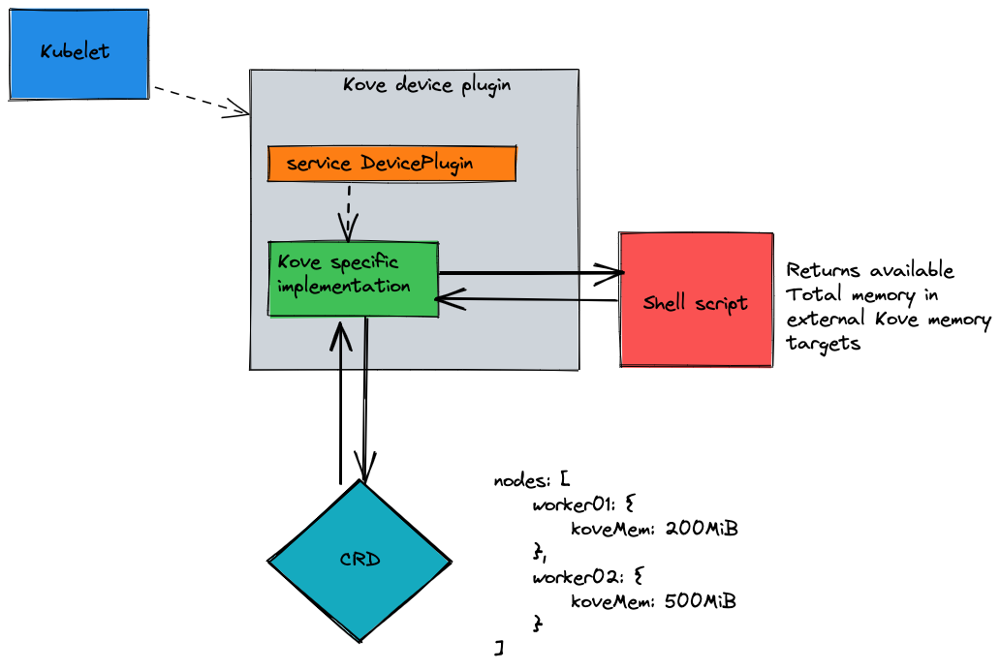

# Kove Kubernetes Device Plugin

Kubernetes device plugin can update the Kubelet about specific hardware 
resource consumptions that are not typically tracked in default 
kubelet implementation. Read more about K8s device plugins 
[here](https://kubernetes.io/docs/concepts/extend-kubernetes/compute-storage-net/device-plugins/).

This is a device plugin that is part of the Red Hat Openshift Container 
Platform and Kove external memory integration solution. This device 
plugin is capable of reporting Kove specific extended resource 
(`kove.net/memory`) consumption in each worker node.

### Design

